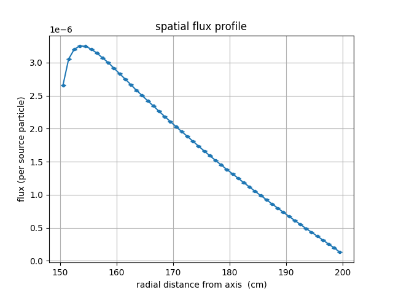
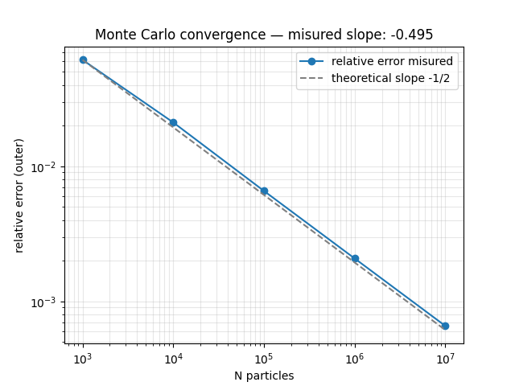
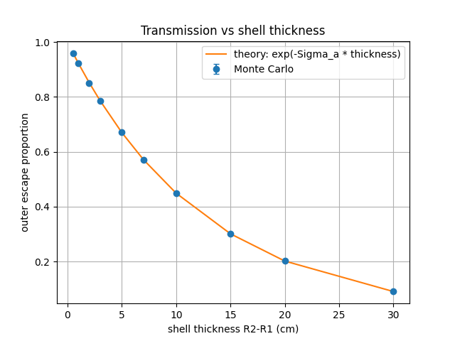
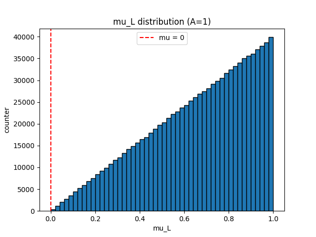

# Monte Carlo Neutron Transport in a Cylindrical Shell

A from-scratch Monte Carlo particle transport code in C++, simulating neutron histories
through a hollow cylindrical geometry. Instead of solving the neutron transport equation
directly, the code samples millions of individual particle random walks and builds up
statistical estimates of absorption, leakage and the spatial flux distribution.

Every physics component was derived and validated against analytical results before being
integrated. The code is parallelised with OpenMP and includes a variance-reduction mode
benchmarked with a figure of merit.

---

## Contents

- [Physics model](#physics-model)
- [Sampling methods](#sampling-methods)
- [Variance reduction](#variance-reduction)
- [Parallelisation](#parallelisation)
- [Validation](#validation)
- [Results](#results)
- [Build and run](#build-and-run)
- [Repository structure](#repository-structure)
- [Possible extensions](#possible-extensions)

---

## Physics model

**Geometry.** A hollow cylinder (annular shell) with inner radius `R1`, outer radius `R2`
and finite height `H`, with its axis along `z`. This represents components found in real
reactor systems — pressure vessel walls, graphite reflector annuli, shielding layers,
fuel cladding.

**Source.** A neutron starts on the inner surface (`R1`, 0, 0) moving radially outward.

**Terminal outcomes.** A history ends in one of four ways, tracked separately:

| Outcome | Condition |
|---|---|
| `absorbed` | Capture event inside the material |
| `escaped_inner` | Radial distance falls below `R1` (re-entry into the cavity) |
| `escaped_outer` | Radial distance exceeds `R2` (transmission through the shell) |
| `escaped_axial` | \|z\| exceeds `H`/2 (leakage through an end face) |

**Approximations.** The model is monoenergetic (one energy group): cross sections are
constant macroscopic values `Sigma_a` and `Sigma_s`, and neutrons do not lose energy on
collision. Cross sections are tabulated at thermal energy (2200 m/s) in `materials.txt`
for ten common reactor materials.

---

## Sampling methods

### Free path — inverse transform sampling

On an infinitesimal path `dx`, the interaction probability is `Sigma_t * dx`, independent
of distance already travelled. This memorylessness gives `dP/dx = -Sigma_t * P`, so the
survival probability is `P(x) = exp(-Sigma_t * x)` and the distance to the next collision
is exponentially distributed. Inverting the CDF:

```
s = -ln(xi) / Sigma_t        xi ~ U[0,1)
```

### Interaction type

`Sigma_t = Sigma_a + Sigma_s` expresses that absorption and scattering are mutually
exclusive. Conditional on a collision occurring:

```
P(absorption) = Sigma_a / Sigma_t
```

sampled by threshold comparison against a uniform variate.

### Scattering angle — CM to lab kinematics

Elastic scattering is isotropic in the centre-of-mass frame, but **not** in the laboratory
frame. The transformation introduces forward peaking that grows stronger for lighter target
nuclei:

```
mu_L = (A*mu_c + 1) / sqrt(A^2 + 2*A*mu_c + 1)
```

Two limits confirm the formula: for `A -> inf` (infinitely heavy nucleus) `mu_L -> mu_c`,
and for `A = 1` (hydrogen) it reduces to `mu_L = sqrt((1+mu_c)/2)`, which is never negative —
a neutron cannot backscatter off hydrogen.

### Direction update in 3D

`mu_L` is measured relative to the neutron's **current** flight direction, not a fixed axis.
An orthonormal frame `(u, v, w)` is built around the current direction `w` using a cross
product with a non-parallel helper axis, and the new direction is:

```
d_new = mu_L * w + sqrt(1 - mu_L^2) * (cos(phi) * u + sin(phi) * v)
```

with `phi` uniform on `[0, 2*pi)`. The result is renormalised each collision; the observed
drift of `|d|` from unity stays below 1e-15 over millions of collisions.

### Flux tally — collision estimator

By definition of macroscopic cross section, the collision rate density equals
`flux * Sigma_t`. Collisions are binned into concentric radial shells, and the flux in
shell `j` is:

```
flux[j] = <collisions in shell j per history> / (Sigma_t * V_shell[j])
V_shell[j] = pi * (r_out^2 - r_in^2) * H
```

Note that shell volume grows with radius — a constant bin width does **not** give constant
bin volume, and ignoring this would artificially inflate the flux in outer bins.

### Uncertainty — history-based scoring

Contributions from a single history to different bins are correlated (they come from the
same random walk), so a naive binomial error is wrong. Scores are accumulated per history
first, then combined:

```
mean = S1/N
variance = S2/N - mean^2
standard error = sqrt(variance / N)
```

For binary outcomes this reduces exactly to `sqrt(p(1-p)/N)`, since `x^2 = x` when
`x` is 0 or 1 — the same estimator covers both tally types.

---

## Variance reduction

The code supports two modes, selectable at runtime.

**Analog.** Direct simulation: a neutron is killed on absorption with probability
`Sigma_a/Sigma_t`.

**Implicit capture (survival biasing).** The neutron carries a statistical weight, reduced
by `Sigma_s/Sigma_t` at every collision, and always survives to scatter. Absorption is
scored continuously as lost weight. The expected weight after a collision is identical to
the analog case, so the estimator remains unbiased — only its variance changes. Russian
roulette (threshold 0.25, survival weight 1.0) terminates histories whose weight has become
negligible, without introducing bias.

Effectiveness is measured with the standard figure of merit, `FOM = 1 / (R^2 * T)` where
`R` is the relative error and `T` the runtime:

| Mode | Outer escape | Relative error | Time (s) | FOM |
|---|---|---|---|---|
| Analog | 0.187491 ± 0.000276 | 1.472e-3 | 1.82 | 2.54e5 |
| Implicit capture | 0.187647 ± 0.000234 | 1.248e-3 | 2.09 | 3.07e5 |

*(lead shell, R1=100 cm, R2=115 cm, H=500 cm, 2×10⁶ histories)*

Implicit capture gives a **1.21× FOM improvement** here, and a **2.3× reduction** in the
uncertainty on the absorption tally specifically — the tally that benefits most, since
every history contributes to it continuously rather than as a single 0-or-1 event. The
means agree within error bars, confirming the method is unbiased.

An honest note on scope: implicit capture alone does **not** solve deep-penetration
problems. For a full PWR vessel wall (~26 mean free paths of steel) both modes return zero
transmission, because the weight decays faster than roulette can compensate. Techniques
such as exponential transform or weight windows would be required there.

---

## Parallelisation

Particle histories are independent, making the history loop embarrassingly parallel
(`#pragma omp parallel for`). Two correctness concerns are handled explicitly:

- **RNG state.** `std::mt19937` is stateful and not thread-safe. Each thread receives its
  own generator, constructed serially before the parallel region and seeded through
  `std::seed_seq` rather than consecutive integers — `seed_seq` applies a mixing function
  designed to produce well-separated internal states from nearly identical inputs.
- **Tally accumulation.** Per-thread accumulators avoid both race conditions and the
  serialisation that a critical section would impose on every history; they are merged in
  a single serial pass after the parallel region.

Results are bit-for-bit reproducible across runs at a fixed master seed, and verified
race-free under ThreadSanitizer.

For reference, OpenMC — a production-grade Monte Carlo transport code — reports
`OpenMP Threads` in its own startup banner, i.e. it uses the same shared-memory
parallelisation approach adopted here.

---

## Validation

Each component was checked against an independent analytical result before integration.

**1. Exponential attenuation law.** With `Sigma_s = 0` (pure absorber), the neutron travels
in a straight line and transmission must equal `exp(-Sigma_a * (R2-R1))` exactly:

```
theoretical outer escape = 0.449329
Monte Carlo              = 0.448853 +/- 0.000352
difference               = -0.000476   (1.35 sigma)
```

Backscatter and axial leakage are both identically zero in this case, as they must be
without scattering.

**2. CM-to-lab kinematics.** For `A = 1`, the sampled distribution of `mu_L` must be
non-negative everywhere and have mean exactly 2/3. Both hold (see the histogram below);
the observed linear ramp also matches the analytical PDF `f(mu_L) = 2*mu_L`.

**3. Particle balance.** The four outcome tallies sum to 1.00000 in every configuration
tested, in both analog and implicit modes.

**4. Flux normalisation.** Summing `flux[j] * Sigma_t * V_shell[j]` over all bins
reproduces the mean number of collisions per history exactly, confirming the volume
normalisation is self-consistent.

**5. Convergence rate.** The defining property of Monte Carlo: statistical error should
scale as 1/sqrt(N).

| N particles | Relative error |
|---|---|
| 10³ | 0.061334 |
| 10⁴ | 0.021108 |
| 10⁵ | 0.006568 |
| 10⁶ | 0.002078 |
| 10⁷ | 0.000658 |

Fitted log-log slope: **-0.495** against a theoretical -0.5, across four decades.

**6. 1D/3D consistency.** After the extension to full 3D vectors, the slab-geometry results
reproduced the earlier 1D implementation within statistical error — the vector formulation
is the same physics, not a different model.

---

## Results

### Radial flux profile



Graphite reflector annulus (R1 = 150 cm, R2 = 200 cm). The flux does not peak at the source
surface but a few centimetres inside it, before decaying outward. This is the **transport
peak**: near a free surface the angular flux has not yet become isotropic, so the scalar
flux is depressed at the boundary and recovers over the first few mean free paths. The
feature emerged from the simulation without being built in.

### Convergence study



Measured slope -0.495 versus the theoretical -1/2.

### Transmission versus shell thickness



Pure absorber, shell thickness swept from 0.5 to 30 cm. Monte Carlo points lie on the
analytical exponential curve across the full range, from 96% transmission down to 9%.

### Anisotropic scattering kinematics



Laboratory-frame scattering cosine for `A = 1` (hydrogen), 10⁶ samples. No negative values
appear — backscatter off hydrogen is kinematically forbidden — and the linear ramp matches
the analytical PDF `f(mu_L) = 2*mu_L`. Sample mean 0.667, against the exact value 2/3.

### Representative benchmark cases

| Case | Inner escape | Absorbed | Outer escape | Axial escape |
|---|---|---|---|---|
| Graphite reflector (150–200 cm, H=1300) | 0.8814 | 0.0320 | 0.0866 | 0.0000 |
| Lead shield (100–115 cm, H=500) | 0.6511 | 0.1614 | 0.1875 | 0.0000 |
| Water annulus (20–25 cm, H=5) | 0.2403 | 0.1418 | 0.1656 | 0.4523 |

Axial escape is zero for tall cylinders — a neutron leaves radially long before random
walking several metres along the axis — and becomes dominant only for squat geometries,
as expected.

---

## Build and run

Requires a C++17 compiler with OpenMP support.

```bash
g++ -fopenmp -O2 main_2.cpp -o main_2
./main_2
```

The program prompts for simulation mode, material, particle count, collision cap, geometry
and bin count. `materials.txt` must be in the working directory.

For a zero-input demonstration with fixed graphite parameters:

```bash
g++ -fopenmp -O2 main.cpp -o main
./main
```

Analysis scripts require `numpy`, `matplotlib` and `pandas`:

```bash
python analysis/plot_flux_profile.py
python analysis/plot_transmission_vs_thickness.py
python analysis/convergence_study.py
```

Note: the analysis scripts contain hard-coded paths to the executable and output files —
adjust them to your local layout before running.

---

## Repository structure

```
.
│ 
├── simulation_core.h      # shared simulation engine (classes, sampling, history loop)
├── full_model.cpp             # interactive: material, geometry, mode all 
├── materials.txt          # thermal cross sections for 10 materials
├── graphite_demo/
│   └── full_model_graphite.cpp               # fixed-parameter graphite demo
├── anisotropic_scattering/
│   ├── anisotropic_scattering.cpp   # standalone CM-to-lab kinematics test
│   ├── plot_mu_distribution.py
│   └── mu_lab_samples.py
├── analysis/
│   ├── plot_flux_profile.py
│   ├── plot_transmission_vs_thickness.py
│   └── convergence_study.py
└── results/                   # generated figures
```

---

## Possible extensions

- **Energy dependence.** The largest physical simplification is the monoenergetic
  treatment. Multigroup cross sections with downscattering would capture moderation, the
  process that actually couples to the anisotropic kinematics already implemented.
- **Advanced variance reduction.** Weight windows or the exponential transform, to make
  deep-penetration shielding problems tractable.
- **Chord-through-cavity handling.** The inner boundary test evaluates position at the end
  of each flight. Since the annulus is non-convex, a chord can cross the cavity and return
  undetected. The effect is negligible when `R1` is large compared to the mean free path,
  but matters for thin-walled small-radius geometries.
- **Benchmark against a production code.** Cross-verification against OpenMC in multigroup
  mode would provide external validation of the physics.
